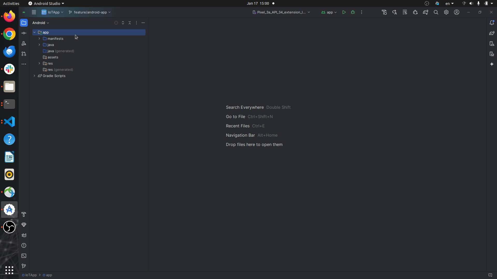

# Smaps Android App

SMAPS (SMArtphone Pressure System) is an android app designed for collecting and processing pressure data from smartphones, primarily for utilization in numerical weather prediction models. 

## Overview

SMAPS is developed to harness the potential of smartphone sensors, making use of their capabilities to gather crucial pressure-related information. By collecting data at regular intervals (7 seconds) and transmitting it to Firebase, SMAPS facilitates the creation of a comprehensive dataset that can enhance the accuracy of weather prediction models.

## Features

- **Data Collection**: SMAPS utilizes various sensors present in smartphones to gather data.
- **Data Transmission**: Collected data is transmitted to Firebase every 7 minutes.
- **Data Attributes**: The following data attributes are collected by SMAPS:
  - Timestamp
  - Latitude
  - Longitude
  - Acceleration (X, Y, Z)
  - Acceleration Standard Deviation (X, Y, Z)
  - Altitude (Mean, Standard Deviation)
  - Horizontal Accuracy
  - Pressure (Mean, Standard Deviation)
  - Speed (Mean, Standard Deviation)
  - Vertical Accuracy

## Installation

You can build your app in Android Studio by following these steps:

1. Open Android Studio.
2. Navigate to `Build -> Build Bundles/APK(s) -> Build APK(s)`.

Then you can find your `.apk` file here:

`~\MyApp_Name\app\build\outputs\apk\debug\app-debug.apk`

The `.apk` file from the last version is already included here:

`android/apk/app-debug-androidTest.apk`

### Important
If you want to run the app yourself, you must create a `google-services.json` file and add it to the `app/` directory. This file is required for Firebase integration and can be generated by following these steps:
1. Go to the [Firebase Console](https://console.firebase.google.com/).
2. Create a new project or use an existing project.
3. Add your Android app to the Firebase project by providing your app's package name (`com.example.iotapp`).
4. Download the `google-services.json` file from the Firebase setup page.
5. Place the downloaded `google-services.json` file in the `app/` directory of your project.

## Run
To run the app, ensure you have completed the steps to create the `google-services.json` file and installed any necessary dependencies in Android Studio.
