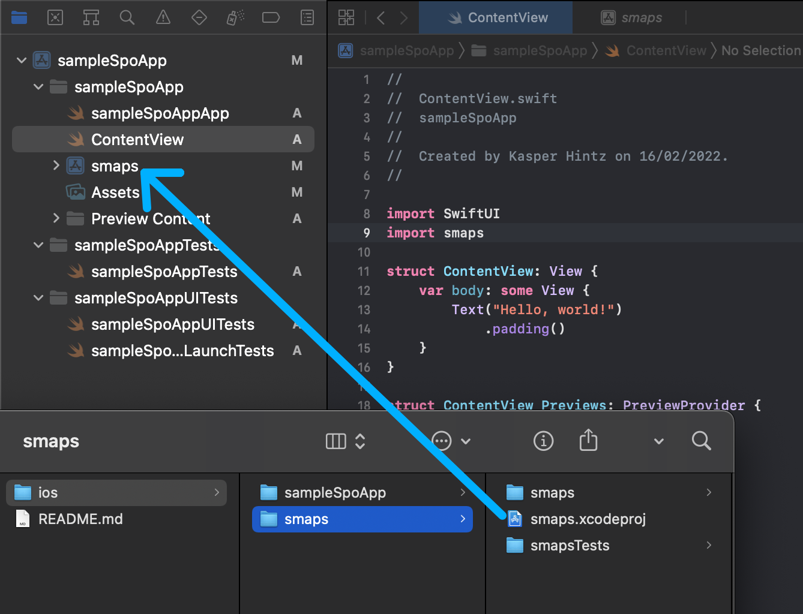

# iOS SMAPS
The **smaps** framework is found in the directory `smaps`. The directory `sampleSpoApp` is a simple example app that uses the **smaps** framework.

## Installation
This *README* describes how **smaps** was installed and utilised in `sampleSpoApp`.

